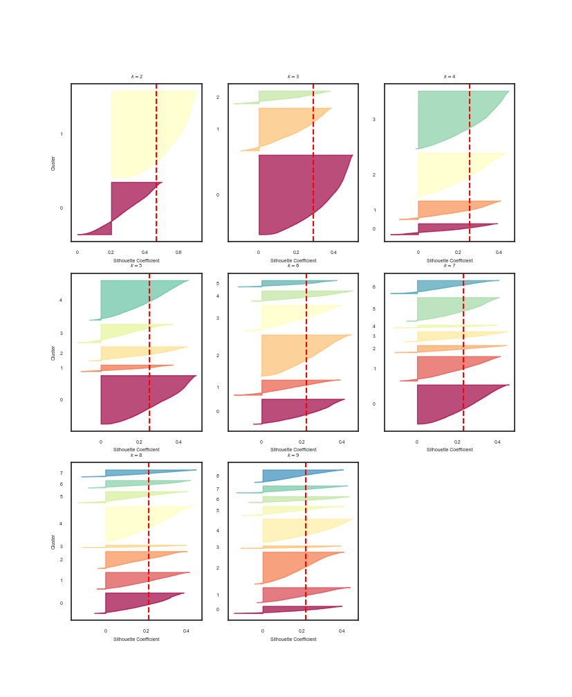

# Waves_Tools

<i> Module contains tools for analyze ocean wave timeseries. Unsurpervised clustering algorithms have been also implemented for classify the ocean wave, according to the caracteristics Hs (Wave amplitude [m]), Tp (Wave period [s]) and Direction (direction of the train wave [°]).</i>

# How it works

<blockquote> class <b>Wave_Tools</b>(data, seasons_split=False,clustering=None, n_k=None, p_err = None) </blockquote>
<h3> Parameters </h3>
 
<blockquote> data :: (DataFrame)</blockquote> 
 <i> DataFrame contains two or Three columns Hs Tp  and Direction, need to be analysed. The variables Direction can be missing.</i>
 
 
<blockquote> seasons_split :: (Bool)</blockquote>
<i> Activate the seasons_split option. If activate the timeserie will be grouped by season : winter, summer, spring and autumn.</i>
 
 
<blockquote> clustering :: (str)</blockquote>
<i> Activate the clustering algorithms. <b>clustering = 'Kmean'</b> for the Kmean method and <b>clustering = 'GM'</b> for the Gaussian mixture model.
The Gaussian mixture model incorporates the anomaly Detection for the timeserie. The keyword <b>p_err</b> controls the anomaly detection.</i>
 
 
<blockquote> n_k :: (range)</blockquote>
number of k clusters tested for set the correct number of cluster. if the option clustering is activated by default n_k = range(2, 10).</i>
 
 
<blockquote> p_err :: (int or float)</blockquote>
<i> p_err controls the anomalie selection. A p_err equal to 1 means that approximately 1 % of the instances will be flagged as anomalies. by default p_err = 1 </i>
 
 
 
<h3> Attributes </h3>
 
<blockquote>_freq_t()</blockquote>
<i>Return the frequencies of occurrence for each feature and the cumulative frequencies.</i>
 
 
<blockquote>plot_frequency()</blockquote>
<i>Return the plots of occurrences and the cumulative frequencies.</i>
 
 
<blockquote>plot_correlogram()</blockquote>
<i>Return the correlogram plots between Hs/Tp, Hs/Direction and Tp/Direction.</i>
 
 
<blockquote>Kmeans_setup()</blockquote>
<i>Return plots Inertia vs number of clusters k and Silouette_score vs number of clusters k.</i>
 
 
<blockquote>Kmeans_run( k )</blockquote>
<i>Return DataFrame containing the controids of each cluster (k).</i>
 
 
<blockquote>GM_setup()</blockquote>
<i>Return plots Information Criterion for each number of cluster.</i>
 
 
<blockquote>GM_run( k )</blockquote>
<i>Return DataFrame containing the mean controids of each cluster(k) and DataFrame containing the anomalies detected</i>

# User Guide
<h3> Occurrences and cumulative frequency </h3>

Let's using a dataset from wave modelling propagation from IFREMER (French institut).

<pre><code> 
print(df_Data)

Out[]: 
                           Hs        Tp  Direction
Time                                              
2016-01-01 00:00:00  2.355760  13.87020    245.966
2016-01-01 01:00:00  2.327610  13.87020    245.675
2016-01-01 02:00:00  2.317590  13.87020    245.664
2016-01-01 03:00:00  2.317530  13.88890    245.944
2016-01-01 04:00:00  2.335020  13.88890    246.426
                      ...       ...        ...
2018-12-30 19:00:00  0.468191  10.00000    254.370
2018-12-30 20:00:00  0.489997   9.90099    254.241
2018-12-30 21:00:00  0.509803   9.80392    254.221
2018-12-30 22:00:00  0.525608   9.70874    254.293
2018-12-30 23:00:00  0.537219  12.65820    254.281

[26280 rows x 3 columns]</code></pre>

<i>Then, for plot the occurrences and the cumulative frequencies whitout the classification and for all the data.</i>

<pre><code> 
Wave_analyse= Wave_Tools(df_Data, seasons_split = False)
Wave_analyse.plot_frequency()
</code></pre>

<i> plot the correlogram </i>
<pre><code> 
Wave_analyse.plot_correlogram()
</code></pre>

<h3> clustering Kmean </h3>
<i>Let's try to clustering the Ocean wave data allow to find a good representation of the Sea state.
First, run the Waves_tools with the option <b>clustering ='Kmean'</b> and try the classification for a number of cluster between 2 and 9.</i>
<pre><code> 
Wave_analyse= Wave_Tools(df_Data,seasons_split=False, clustering='Kmean', n_k = range(2, 10) )
</code></pre>

<i> For extract the wave parameters centroids for 3 clusters k=3 </i> 
<pre><code> 
Wave_Tools.Kmean_run(k=3)

Wave_analyse.clusters
Out[]: 
         Hs         Tp   Direction
0  0.704627  10.005830  256.922928
1  1.713324  13.182331  246.245376
2  0.940236   8.564546  208.884613
</code></pre>

<h3> Clustering Gaussian mixture </h3>
<i>For using the Gaussian mixture clustering and plot the Information Criterion for the n_k cluster.</i>
<pre><code> 
Wave_analyse= Wave_Tools(df_Data,seasons_split=False, clustering='GM', n_k = range(2, 10))
</code></pre>

<i> For extract the means of each Gaussian distribution, for exemple 3 clusters </i>
<pre><code> 
Wave_analyseGM_run(k=3)

Wave_analyse.clusters
Out[]: 
         Hs         Tp   Direction
0  0.715112  10.480407  258.281613
1  0.914657   9.406316  225.689229
2  1.642781  12.259621  246.167100
</code></pre>

<i> The anomalies detection are computed and piloted by the keyword </b>p_err</b>
by default p_err = 1</i>
<pre><code> 
Wave_analyse.anomalies
Out[]: 
          Hs        Tp  Direction
0    2.12410  14.08450    219.940
1    2.24668  14.08450    218.636
2    2.33167  14.08450    219.359
3    2.72504   7.07363    219.721
4    2.78693   7.20032    218.401
..       ...       ...        ...
258  1.94344  20.40820    235.534
259  2.01508  20.00000    236.814
260  2.17187  13.17470    216.967
261  2.23055  13.51350    217.038
262  2.26567  13.88890    220.035

[263 rows x 3 columns]
</code></pre>
